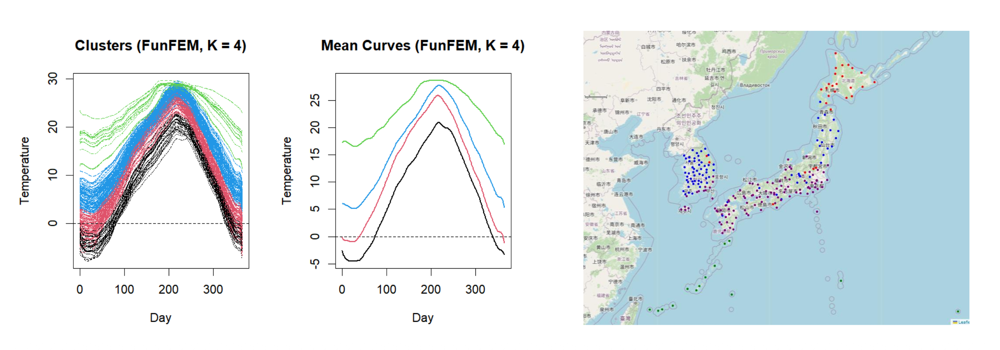

  [slides](../../files/project_fc.pdf)

---

::: {.figure}
{width=90% fig-align="center"}
:::

Annual climate curves naturally exhibit the characteristics of functional data. Building on this perspective, this study analyzes region-specific annual climatological temperature data from South Korea and Japan using functional clustering techniques. We apply algorithms specifically developed for functional data, along with functional principal component analysis (FPCA), and compare their results to those obtained from conventional clustering methods. Through such a comparison, the study provides a data-driven classification of regional climate patterns, offering an objective alternative to traditional climate classification approaches.