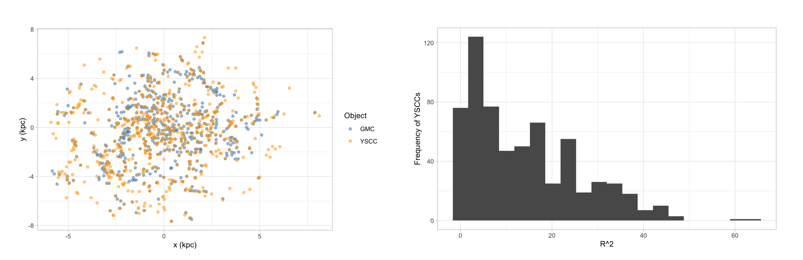

  [report](../../files/project_m33.pdf)

---

::: {.figure}
{width=90% fig-align="center"}
:::

Star formation in galaxies has long been a fundamental topic in astrophysics. While it is widely believed that the high-density environments produced by Giant Molecular Clouds (GMCs) play a key role in the formation of new stars, the underlying mechanisms are not yet fully understood. This project examines the relationship between Giant Molecular Clouds and Young Stellar Cluster Candidates (YSCCs) using point process models that capture spatial nonstationarity. In particular, we apply variable selection within the inhomogeneous Poisson process and the Neyman–Scott process to characterize and quantify this relationship.